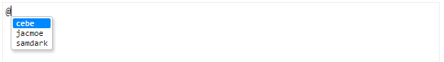

CodeMirror autosuggest addon
============================

Triggers autocompletion when certain character is typed.



## Usage

Include scripts needed into webpage.

```html
<script src="bower_components/codemirror/lib/codemirror.js"></script>
<script src="bower_components/codemirror/addon/hint/show-hint.js"></script>
<script src="bower_components/codemirror-autosuggest/autosuggest.js"></script>
```

Initialize CodeMirror specifying suggestions config as an array in `autoSuggest` config property.

```javascript
var editor = CodeMirror.fromTextArea(document.getElementById('text'), {
	mode: 'gfm',
	autoSuggest: [
        {
            mode: 'markdown',
            startChar: '@',
            listCallback: function() {
                return [
                    {
                        text: 'cebe ',
                        displayText: 'cebe'
                    },
                    {
                        text: 'jacmoe ',
                        displayText: 'jacmoe'
                    },
                    {
                        text: 'samdark ',
                        displayText: 'samdark'
                    }
                ];
            }
        },
        {
            mode: 'markdown',
            startChar: '#',
            listCallback: function() {
                return [
                    {
                        text: '#hash ',
                        displayText: 'hash'
                    }
                ]
            }
        }
    ]
});
```
